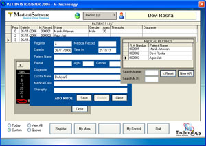



## VBDOCTOR 2007

### Description

MEDICAL SOFTWARE,.... NEW UPDATE, more stabil then older version. Software design fot general doctor practioner. Usefull software for doctor including : Patient register, medicine input, doctor certificate, id card maker , billing statement and etc. No OCX Needed, XP Style version.
 
### More Info
 

             |
---                |---
**Submitted On**   |2006-12-02 03:03:46
**By**             |[Manik Artawan](https://github.com/Planet-Source-Code/PSCIndex/blob/master/ByAuthor/manik-artawan.md)
**Level**          |Intermediate
**User Rating**    |4.6 (41 globes from 9 users)
**Compatibility**  |VB 6\.0
**Category**       |[Complete Applications](https://github.com/Planet-Source-Code/PSCIndex/blob/master/ByCategory/complete-applications__1-27.md)
**World**          |[Visual Basic](https://github.com/Planet-Source-Code/PSCIndex/blob/master/ByWorld/visual-basic.md)
**Archive File**   |[VBDOCTOR\_22034541222006\.zip](https://github.com/Planet-Source-Code/manik-artawan-vbdoctor-2007__1-67198/archive/master.zip)

